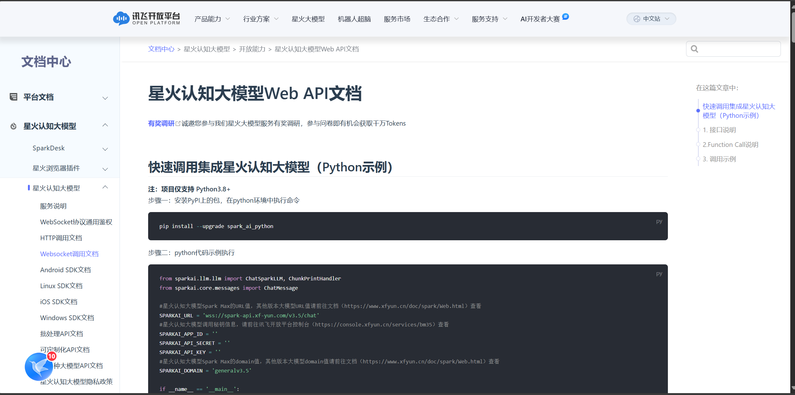

# 关于本项目

## 可供参考的网页：
[Ollama-python](https://github.com/ollama/ollama-python/tree/main/examples)
[Ollama-blog](https://ollama.org.cn/blog/)
[batch-learning](https://blog.csdn.net/csfchh/article/details/106795352)

## 个人最新的想法：
1. httpx不开session可能导致ai不能知道你之前说了啥，回去测试。不开和开的区别  --> **不是这个问题，需要手动上传聊天记录** => 此问题已被chat.json文件搞定
2. 尽量不要使用http请求吧，用封装好的第三方库可能更快，并且功能更多
3. Qt窗口一开始势必要引导用户完成初始化操作 自己画图片 颜色转不透明度变成全透明 插入qt窗口 并设置位置关闭该图片&切到下一张图片(如果没有图片则退回正常页面)
4. 势必要支持图片&视频的上传 只会聊天没啥屁用
5. 自动调用.bat脚本帮助用户安装必要第三方扩展啥的 => 如果真的做成Qt了不是可以直接用pyinstaller打包？好像犯不着这样

## 可以优化的算法
1. logger第一轮直接初始化，别特么那么多地方都去调logger

## 可能需要解决的地方
1. logger毕竟是控制台玩物，真做成了Qt就都得删了

## 1. 想要做什么 
> 1. AI聊天机器人 **支持图片/文字 甚至是语音(tts/asr)**
> 2. 可能还有一点 **使用live2D**
> 3. 与其他搜索引擎的对接 目前想法是使用高并发爬虫 => **不需要 Qt有QtWebEngine组件**
> 4. Qt界面 **用PyQt5** (小黑窗虽然实用 但是太丑了)
> 5. 开放wss协议 => 不要只用http协议 **比较耗资源**
> [只针对Spark](https://www.xfyun.cn/doc/spark/Web.html#%E5%BF%AB%E9%80%9F%E8%B0%83%E7%94%A8%E9%9B%86%E6%88%90%E6%98%9F%E7%81%AB%E8%AE%A4%E7%9F%A5%E5%A4%A7%E6%A8%A1%E5%9E%8B%EF%BC%88python%E7%A4%BA%E4%BE%8B%EF%BC%89)

## 2. 目前的进度：
- [ ] 登录注册等操作(需要记录用户信息 也许可以不写 
    => 在初次打开应用时提供一个接口 用于指引申请API Key，建议使用aihubmix但不强求
    **重点只在于需要用户自行提供API Key 和 Base URL**)
- [ ] 目前发现了个免费的ChatGPT项目 但依赖于代理 需要**整代理池** => 代理池不稳定 废弃
- [ ] ollama本地模型对接 => **支持自定义本地模型，需要写shell脚本装ollama以及本地大模型**
- [ ] TTS 和 ASR
- [ ] (理论上可能)需要数据库 => 阿里云 部署linux主机 TCP/IP编程 Gin服务器
- [ ] ZeroMQ, RabbitMQ选一个 **用于网络服务器**
- [ ] Redis 可能会用得上
- [x] OpenAI及其他AI对接
- [x] Spark AI对接
- [ ] 多轮聊天 => 目前Spark AI的多轮聊天已完工
- [ ] (如果可能)加入自己的AI模型
- [ ] ui界面
- [x] 机器人对话 文字
- [ ] 机器人对话 图片
- [ ] 机器人对话 语音
- [ ] live2D模型

## 3. API接口网址
- [Spark AI](https://www.xfyun.cn/doc/platform/xfyunreadme.html)
- [Langchain](https://python.langchain.ac.cn/docs/how_to/)
- [AIhubmix](https://doc.aihubmix.com/) => 我的评价是没啥用

## 4. 其他
- [ ] 代码规范
- [x] 代码注释
- [ ] 代码测试
- [ ] 代码优化
- [ ] 代码打包
- [ ] 代码部署
- [ ] 代码维护